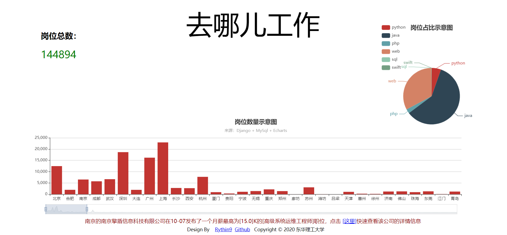

#

## 项目简介

   本项目使用IDE为`Pycharm` + `Anaconda3`，语言为`Python3`，数据库用的是`MySQL`, 使用`ECharts` + `JavaScript` 来构建前端页面。

## 展示页面

## 数据库配置
- 新建数据库名称`zhaopin`
- 因为数据库文件过大，可自行爬取数据
- 表属性名在`sql.txt`中，可以根据自己的需求修改

## 项目启动
- `python manage.py runserver`
- 打开`localhost:8000`端口即可看见效果

## 一些用到的命令
- Python的安装：略
- 安装Django：`pip install django`,默认为最新版本，可在后面加上版本号安装自己想要的版本
- 新建Django项目：`django-admin startproject xxx`,'xxx'表示项目名称。
- 新建app：`python manage.py startapp appname`,'appname'为你的app名称。
- 运行：`python manage.py runserver`
- 在已有数据库表的情况下使用此命令可以自动创建`models.py`用来操作数据库：`python manage.py inspectdb > models.py`，把创建好的`models.py`替代原来的便可以操作数据库
- 没有表的情况下：
    - 在`models.py`中创建自己的表
    - `python manage.py makemigrations`
    - `python manage.py migrate`

- `index.html`中为几个`div`，通过`static/main.css`控制大小和格式,通过js异步接受来自`views.py`传来的数据

## 项目总结
+ 因为自身示例的原因，项目写的过于简洁。
+ Python的模块化感觉还是很强大的，这门语言上手起来也快。
+ Python语法虽然简单，但它和任何一门语言比起来都一样，会一点很容易，精通还是要点时间
+ 爬虫部分由于是以前写好的，用的是接口实现，没有用到`Scrapy`框架

## 感谢以下老哥的博客：
- [刘江的博客](https://www.liujiangblog.com/course/django/)
